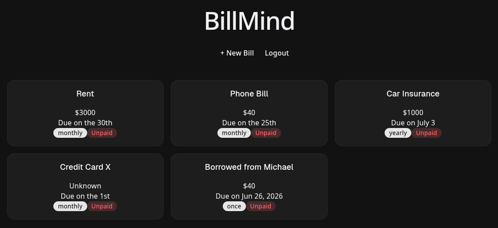
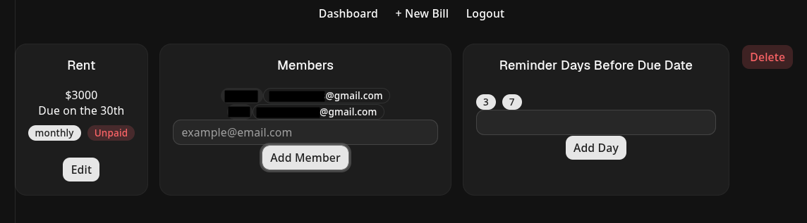

# BillMind

A full-stack bill reminder app that lets users define their bills and reminder schedules, and BillMind automatically sends email notifications through a pub/sub pipeline with support for shared reminders across multiple users.

   
  <em>Dashboard</em>

 

   
  <em>Details</em>

## Motivation

Most brokerages and banks already send payment reminders, but only for their own services. I wanted something personal, a single place to track *all* types of bills (rent, utilities, subscriptions, insurance) with custom reminder schedules per bill. More importantly, I share expenses with family members and wanted a way to notify everyone involved automatically, not just myself.

I also kept missing upcoming payments and juggling reminders across different apps, so I built BillMind to bring everything into one place and make bill tracking simple, flexible, and easy to rely on.

## 🚀 Quick Start

### Prerequisites
- Node.js 20+
- Docker

See the [Contributing](#-contributing) section for full local setup instructions.

